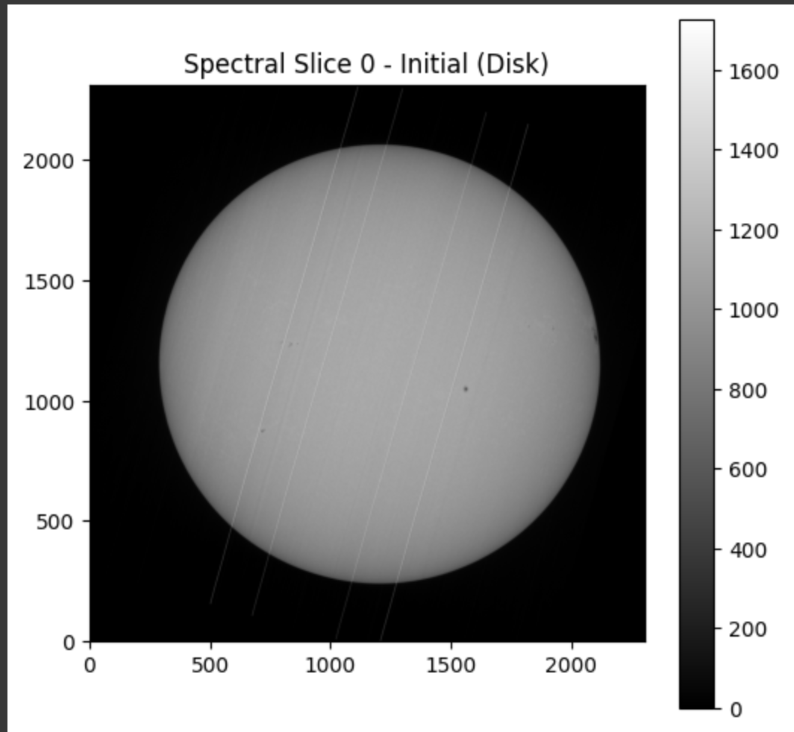
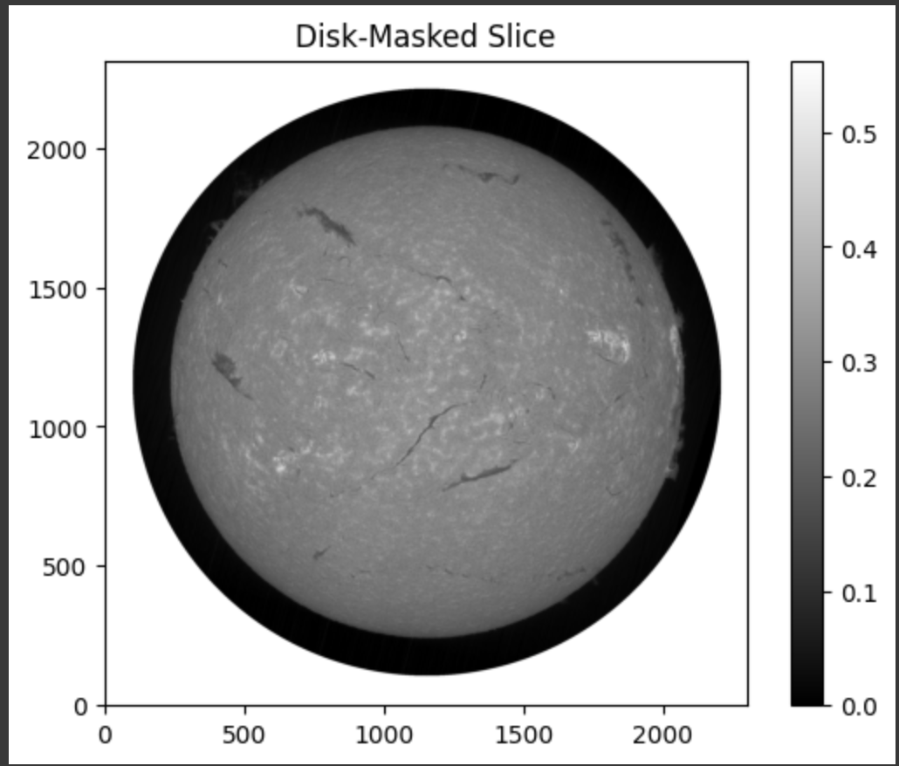
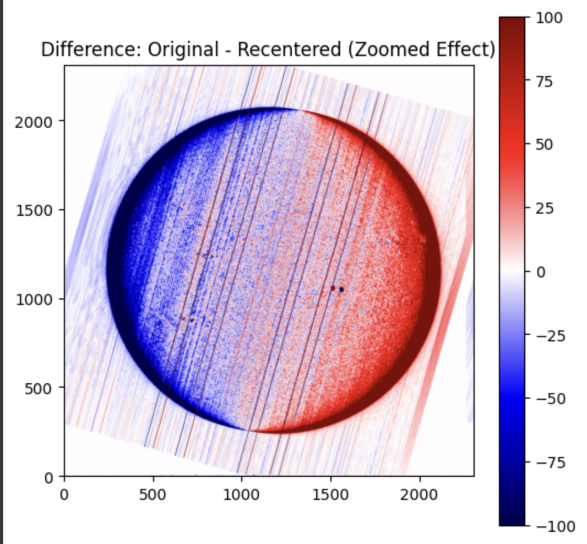
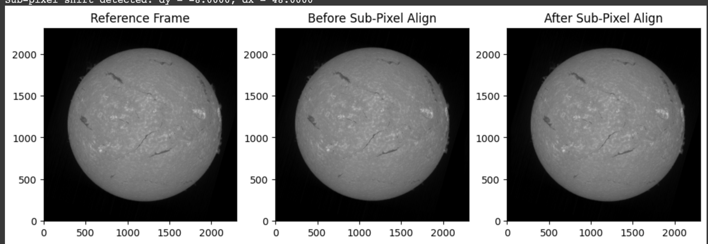
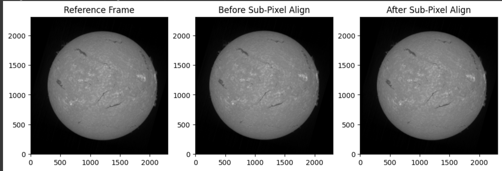
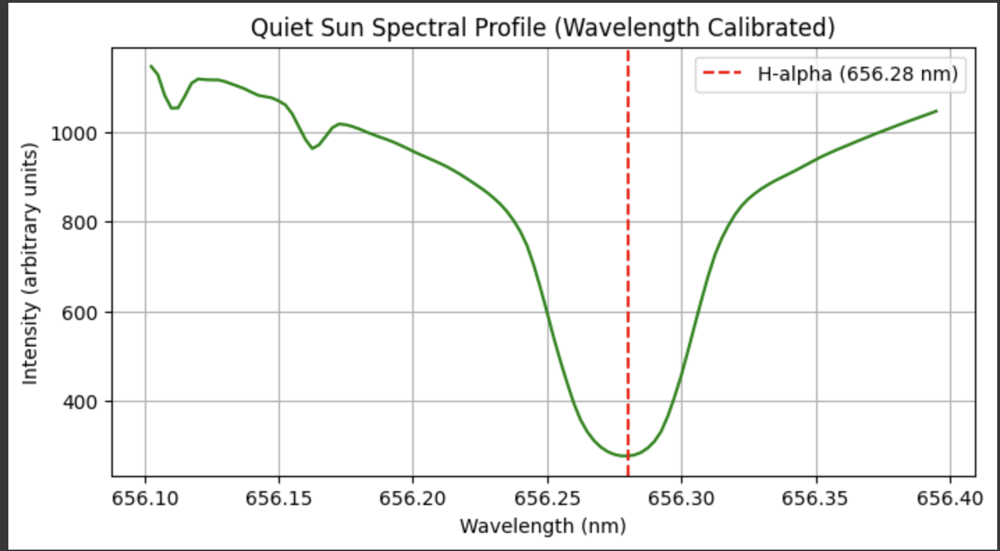
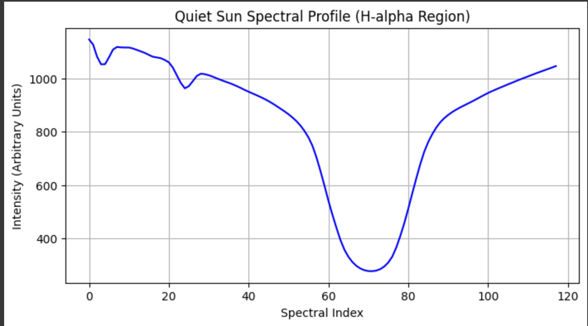
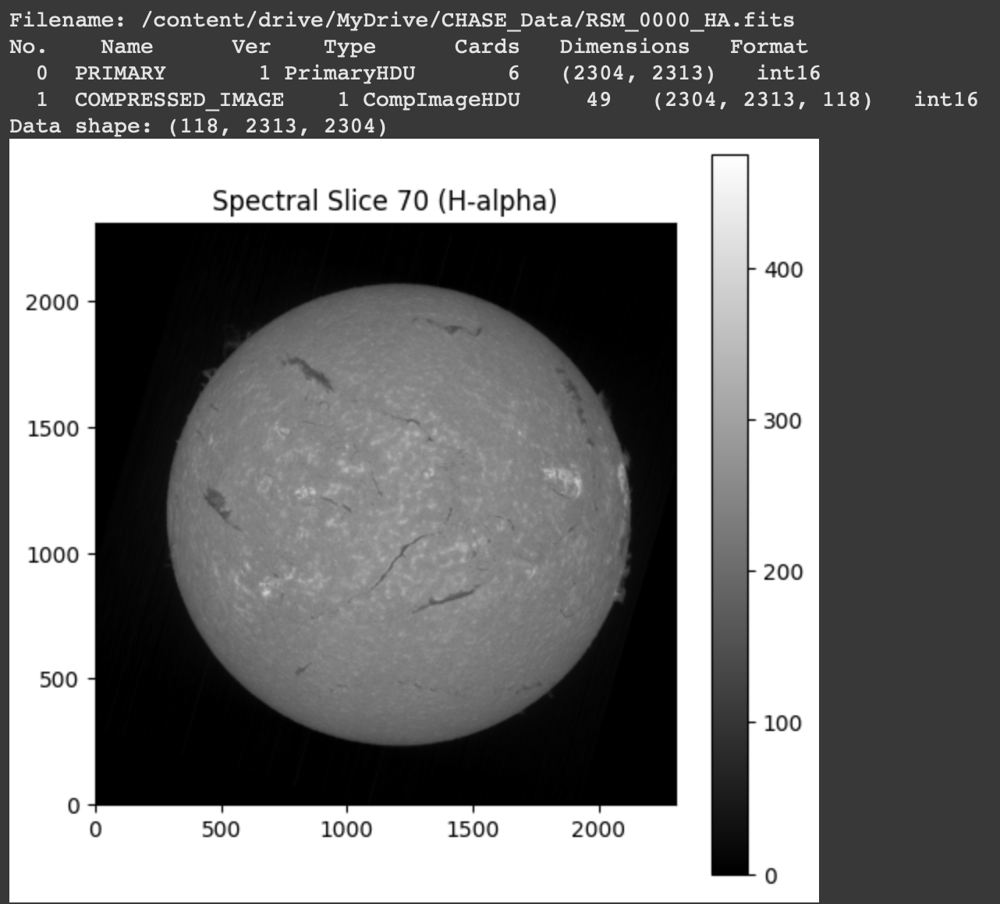
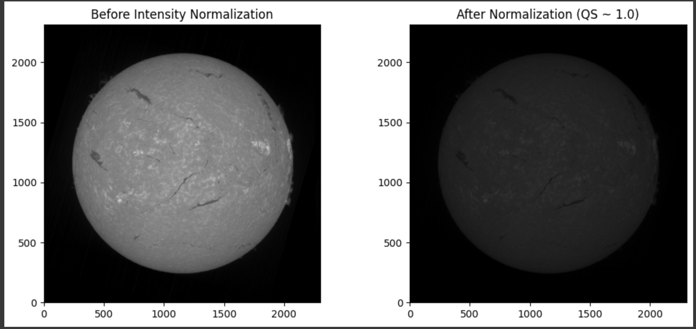
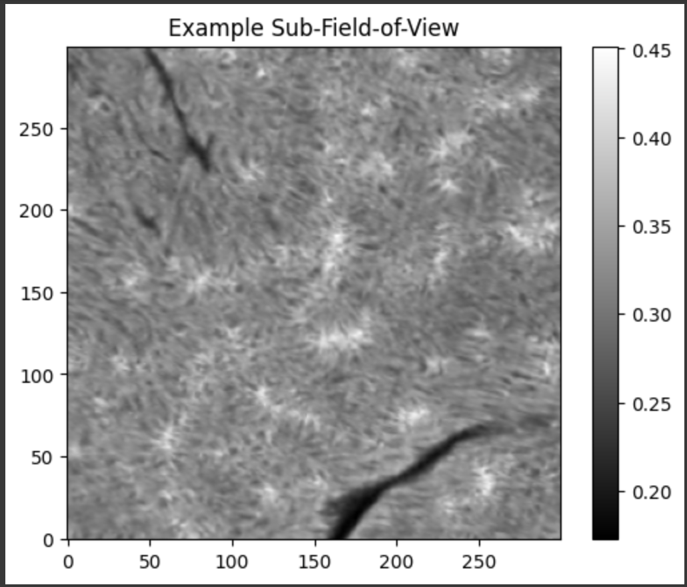

# 🌞 CHASE Satellite Data Calibration Pipeline


The **CHASE Calibration Pipeline** is a terminal-based Python toolkit for downloading and processing solar flare data from the [Chinese Hα Solar Explorer (CHASE)](https://ssdc.nju.edu.cn).  
It includes **spatial**, **spectral**, **intensity**, and **field-of-view** calibration steps.

---

## 📦 Features

- ✅ Download FITS files directly or from a list (`.txt`)  
- ✅ Resume interrupted downloads with progress bar  
- ✅ Spatial calibration (disk center detection + recentering)  
- ✅ Sub-pixel image alignment using Fourier shift  
- ✅ Spectral calibration from QS profile  
- ✅ Intensity normalization and FOV extraction  
- ✅ CLI or importable Python API

---

## 🚀 Quick Start
[](https://colab.research.google.com/drive/1XSw8wow6hUDY-z8HOUtTTFK_kNtv7uj2?usp=sharing)

### 1. Clone the repo
```bash
git clone https://github.com/Majboor/chase-pipeline
cd chase-pipeline
````

### 2. Install dependencies

```bash
pip install -r requirements.txt
```

### 3. Run from command line

```bash
python main.py --input "https://ssdc.nju.edu.cn/chase/2025/5/1/your_fits_file.fits?...sig..." --output ./downloads --save-figs
```

OR pass a `.txt` file with multiple URLs:

```bash
python main.py --input fits_list.txt --output ./downloads
```

---

## ⚙️ CLI Arguments

```bash
--input           Path to FITS URL or .txt list of URLs  
--output          Directory where FITS files will be downloaded (default: ./downloads)  
--threshold       Brightness threshold for disk detection (default: 0.2)  
--accuracy        Upsample factor for subpixel alignment (default: 100)  
--qsbox           Quiet Sun box size for spectral calibration (default: 100)  
--fov-width       Field of view width in pixels (default: 300)  
--fov-height      Field of view height in pixels (default: 300)  
--no-spatial      Skip spatial calibration  
--no-subpixel     Skip subpixel alignment  
--no-spectral     Skip spectral calibration  
--no-intensity    Skip intensity normalization  
--no-fov          Skip sub-FOV extraction  
--save            Save all diagnostic plots (e.g., QS profile, intensity maps)  
--fig-dir         Output directory for saved figures (default: ./figures)  

```

---

## 🧪 Example Notebook

You can explore the pipeline interactively in:

```bash
tutorial.ipynb
```

---

Here is the updated `README.md` section with a link to `docs.md` for full documentation:

---

## 🧪 Python Module Usage

You can also use the CHASE calibration pipeline as a Python **library** in notebooks, scripts, or your own applications.

### 🔹 Example Usage

```python
from chase.core import run_pipeline

run_pipeline(
    fits_file = "./downloads/RSM20250501T233548_0000_FE.fits",
    do_spatial   = True,
    do_subpixel  = True,
    do_spectral  = True,
    do_intensity = True,
    do_fov       = True,
    save_figs    = True,
    fig_dir      = "./figures",
    threshold_ratio   = 0.2,
    subpixel_accuracy = 100,
    qs_box_size       = 100,
    fov_width         = 300,
    fov_height        = 300
)
```

### 🧠 Modular Functions

You can also call individual steps directly:

```python
from chase.core import (
    load_fits_data,
    recenter_image_cube,
    align_subpixel,
    extract_qs_region,
    calibrate_wavelength,
    normalize_intensity,
    extract_subregion
)
```

### 📄 Full API Documentation

For a complete breakdown of each function, parameters, and advanced examples, refer to the [📘 `docs.md`](./DOCS.md) file.

---

## 📸 Output Visuals (Diagnostics)

Below are sample outputs saved during a typical run with `--save-figs`:

| Image                                      | Description                                                                                                                  |
| ------------------------------------------ | ---------------------------------------------------------------------------------------------------------------------------- |
|  | **Raw slice** from the original FITS data cube before any processing (typically slice 70).                                   |
|            | Slice showing the **solar disk** and brightness structure before recentering. Useful for checking disk detectability.        |
|            | The result after **spatial calibration**, where the disk is aligned to the center.                                           |
|                 | Pixel location of the detected **disk center**, later used to convert to arcseconds.                                         |
|              | Output of **sub-pixel alignment**, used to reduce jitter and motion between slices.                                          |
|        | Intermediate **Quiet Sun spectral profile** plot, showing intensity vs. slice index.                                         |
|      | Calibrated **spectral profile** with real wavelengths in Ångströms, aligned to H-alpha 656.28Å.                              |
|        | Example of a **spectral slice** used in calibration and wavelength assignment.                                               |
|         | A slice before **intensity normalization**, showing raw relative brightness.                                                 |
|               | Cropped **field-of-view (FOV)** region after all calibrations. Typically centered on solar disk with dimensions set via CLI. |

Each image was generated from a single FITS cube and saved using the `--save-figs` flag.

---

## 📁 Project Structure

```
chase/
├── chase/
│   ├── __init__.py         # Package entry
│   ├── core.py             # All core calibration logic
│   ├── cli.py              # CLI parser
├── main.py                 # Entrypoint
├── requirements.txt        # Dependencies
├── README.md               # This file
├── tutorial.gif            # Visual usage guide
├── tutorial.ipynb          # Interactive notebook
└── assets/
    └── <images are here>/                # Diagnostic figures like spectra and FOVs
```

---

## 🤝 Acknowledgements

Developed as part of the CHASE calibration project supervised by:

* Prof. Dr. Sayed Amer Mahmood
* Dr. Alexander Pietrow
* Dr. Malcolm Druett

Data courtesy of the [CHASE Satellite](https://ssdc.nju.edu.cn).

---

## 📜 License

MIT License

