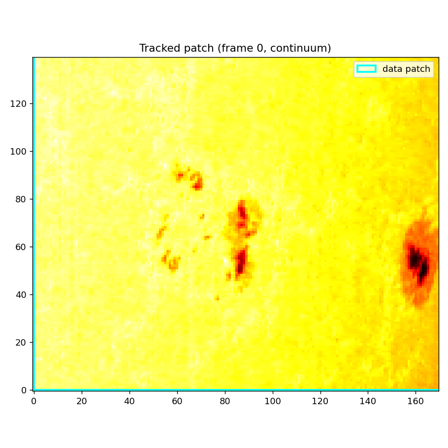
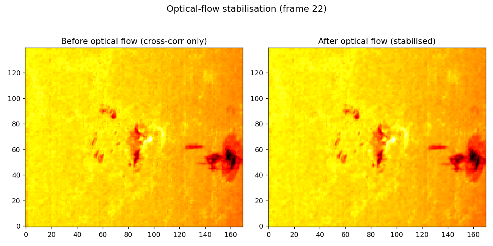
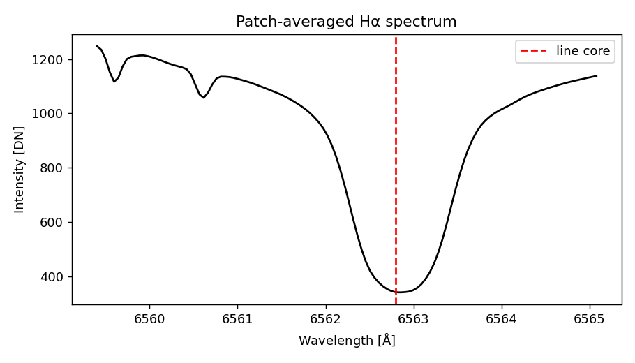
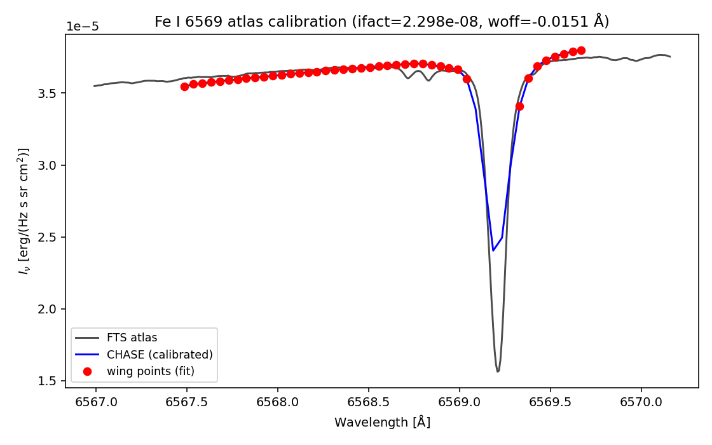
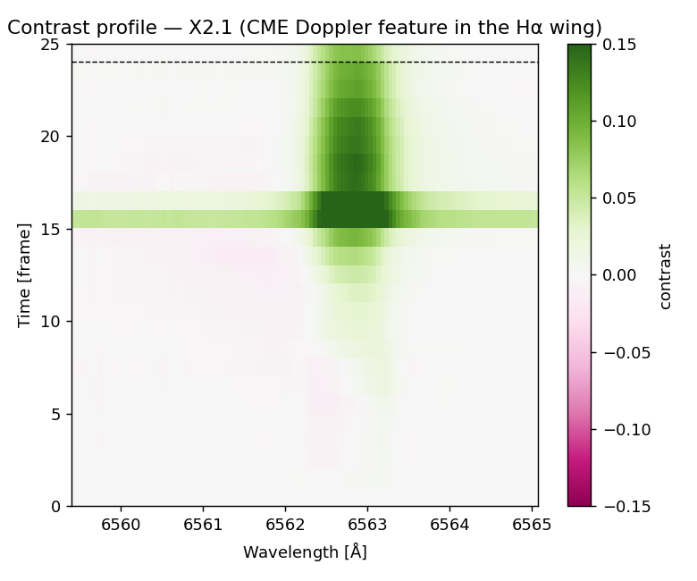
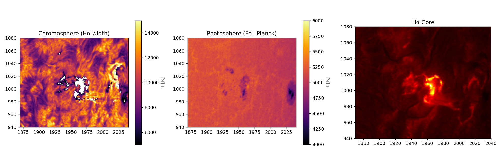

# chase-pipeline

**A modular calibration and flare-analysis pipeline for CHASE / HIS solar spectroscopy — with a TUI, a Python SDK, and a one-file config workflow.**

[](https://github.com/Majboor/chase-pipeline/actions/workflows/test.yml)


CHASE (the **Chinese Hα Solar Explorer**) scans the full solar disk in Hα (118
wavelengths, 6559.4–6565.1 Å) and Fe I (46 wavelengths, ~6569 Å). The raw data is
scientifically rich but awkward to use — every frame drifts spatially *and*
spectrally, and turning a stack of `RSM…_HA.fits` cubes into a clean, aligned,
calibrated data product takes a lot of careful work. `chase-pipeline` does that
work for you, and lets you do as much or as little of it as you want.

<p align="center">
  <br>
  <em>The 2023-03-29 <strong>X2.1</strong> flare, stabilised by this pipeline:
  photosphere (Hα continuum) | chromosphere (Hα core). 25 frames, per-frame colour scaling.<br>
  Rendered with <code>--flow-method farneback</code>: TV-L1 optical flow blocks at the flare peak
  (its total-variation regularizer turns the brightening into a rigid motion block); Farneback stays
  clean. See <a href="docs/FLARE_STABILIZATION.md">docs/FLARE_STABILIZATION.md</a>.</em>
</p>

---

## Why this exists (statement of need)

CHASE data is under-used because it is hard to use: the portal ships full-disk
cubes with no co-alignment, a per-frame wavelength zero-point that drifts by ~0.8
channels, and no turnkey way to extract a science-ready region. Existing scripts
(including the original `chase-pipeline` and Finlay Davis's `satprocess`) each
solved part of the problem. **This package unifies them into one installable
tool** that:

- **just works for the lazy user** — point at a folder, set a field of view and a
  few true/false flags in a text file (or use the TUI), run once, get an aligned
  **FITS/npz cube + images/GIF** out;
- **stays hackable for the power user** — every stage is an importable function
  (`import chase`), nothing is a forced monolithic pipeline;
- **preserves the physics** — shift-then-crop tracking, per-frame wavelength
  resampling, flare-free alignment, absolute atlas calibration, and the correct
  temperature inversions per line (it does not "simplify away" the hard-won fixes).

## Install

Clone the repository first, then install from the clone:

```bash
git clone https://github.com/Majboor/chase-pipeline.git
cd chase-pipeline

pip install -e .                 # core
pip install -e '.[tui]'          # + Textual TUI  (chase-tui)
pip install -e '.[atlas]'        # + ISPy for absolute Fe I temperature calibration
pip install -e '.[all]'          # everything, incl. test deps
```

A PyPI release (`pip install chase-pipeline`) is planned; until then the
clone-and-install route above is the supported one.

## Three ways to use it

### 1. TUI — interactive, no flags to memorise

```bash
chase-tui
```

**End-to-end walkthrough** — the real TUI configured on the 2023-03-29 X2.1
flare (data source → field of view → calibration → temperature → a before/after
of the stabilisation → the actual `flare.gif` / `temperature.gif` /
`contrast_profile.gif` output):

<p align="center">
  
</p>

> Prefer the full-resolution, scrubbable version?
> [assets/tui_e2e_walkthrough.mp4](https://github.com/Majboor/chase-pipeline/raw/feat/unified-pipeline-tui-sdk/assets/tui_e2e_walkthrough.mp4).

Pick a data source, enter a full FOV or an arbitrary patch (and a separate, smaller
*alignment* patch if you want), tick the calibrations you want, and hit **Run** —
live progress streams into the log pane. The TUI is a thin front-end over the SDK;
it duplicates no logic.

**Before / after** — what the spatial calibration buys you. Left: a raw fixed
crop of the portal data, drifting frame to frame. Right: the same patch after
shift-then-crop tracking + optical-flow stabilisation (Hα core):

<p align="center">
  
</p>

### 2. Config file — the "lazy" one-shot workflow

```bash
chase --config examples/config.toml
```

```toml
# examples/config.toml
fits_dir = "/data/20230329_X12/fits"
out_dir  = "./chase_out"
patch    = [940, 1080, 1870, 2040]   # [y0, y1, x0, x1]; omit + full_fov=true for whole disk
contrast = true
temperature = "double"               # halpha + fe_planck
gif = true
freeze_clim = true
```

### 3. CLI — explicit flags (backward compatible)

```bash
chase /data/20230329_X12/fits \
      --patch 940 1080 1870 2040 \
      --align-patch 980 1040 1920 1990 \
      --contrast --temperature double --freeze-clim
```

Every run checkpoints the aligned cubes to `out_dir/aligned_data.npz`, so you
never have to redo the slow load + align stages just to tweak an output —
rerun a single step against the checkpoint with `--only` (implies `--resume`):

```bash
chase /data/20230329_X12/fits --out ./chase_out --only gif            # just re-render the animation
chase /data/20230329_X12/fits --out ./chase_out --only contrast,gif --no-drift
chase /data/20230329_X12/fits --out ./chase_out --only temperature --temperature fe_voigt
```

Steps: `gif`, `contrast`, `temperature`, `npz`, `fits`, `diagnostics`. Plain
`--resume` keeps your normal toggles and only skips load + align. (Changing the
patch or alignment options needs a fresh run *without* `--resume` — the
checkpoint stores the cubes as they were cropped and aligned.)

### …and the SDK — call any single stage

```python
import chase

# Load + crop-track a sequence (shift-then-crop, per-frame wavelength resample)
seq = chase.load_flare_sequence("/data/20230329_X12/fits",
                                patch=[940, 1080, 1870, 2040])

# Fine-stabilise with optical flow on the flare-free channel; HA stays float32
aligned = chase.optical_flow_align(seq["ha_cubes"], reference=seq["align_ref"])

# Science products
contrast, _ = chase.contrast_profile(aligned, background=seq["ha_bg"])
ha_T, _ = chase.halpha_width_temperature(aligned[24], seq["wavelength_ha"])  # Molnar 2019
```

Or run the whole thing in one call:

```python
from chase import Config, run_pipeline
run_pipeline(Config(fits_dir="/data/.../fits", patch=[940,1080,1870,2040],
                    contrast=True, temperature="double"))

# Later: rerun only the outputs you care about, from the saved checkpoint
run_pipeline(Config(fits_dir="/data/.../fits", out_dir="./chase_out",
                    resume=True, gif=True, temperature="fe_voigt"))
```

## What each subpackage does (one figure each)

| Subpackage | What it does | |
|---|---|---|
| `chase.io` | Resumable download, folder / list-file / URL discovery, cube + sequence loading |  |
| `chase.calib.spatial` / `.align` | Shift-then-crop tracking + optical-flow stabilisation |  |
| `chase.calib.wavelength` | Per-frame resampling onto a common grid; spectral-drift xcorr |  |
| `chase.calib.intensity` | QS norm, integral scaling, FTS-atlas absolute calibration (ISPy) |  |
| `chase.analysis.contrast` | `(flare−bg)/bg − frame0` wavelength-vs-time profile |  |
| `chase.analysis.temperature` | Hα width→T (Molnar) + Fe I →T (Planck/EB/Voigt) |  |

<p align="center">
  <br>
  <em>Double temperature map: chromosphere from Hα width (~10⁴ K) and photosphere
  from Fe I Planck inversion (~5,100 K, absolute-calibrated against the FTS atlas).</em>
</p>

## Documentation

- **[docs/DATA_ACQUISITION.md](docs/DATA_ACQUISITION.md)** — get from the CHASE portal to a processed cube, end to end.
- **[docs/SDK.md](docs/SDK.md)** — the Python API, every function + parameters.
- **[docs/TUI.md](docs/TUI.md)** — TUI walkthrough.
- **[docs/CALIBRATION.md](docs/CALIBRATION.md)** — the science: what each calibration does and why.
- **[docs/CONTRIBUTING.md](docs/CONTRIBUTING.md)** — dev setup, tests, style.

## Tests

```bash
pip install -e '.[dev]' && pytest -q     # 22 fast tests on synthetic FITS fixtures
```

## Acknowledgements

Built with the guidance and corrections of **Dr. Alexander Pietrow** (AIP) and
**Dr. Malcolm Druett**. The Hough-circle limb centring, spectral
cross-correlation, integral intensity scaling, and CSV shift-cache are adapted
from **Finlay Davis**'s [`satprocess`](https://github.com/FinlayDavis/satprocess)
(BSD-3-Clause; see [`NOTICE`](NOTICE)). Affiliation support from **Prof. Dr. Sayed
Amer Mahmood** (University of the Punjab). Data courtesy of the **CHASE/HIS**
mission and the [Solar Science Data Center, Nanjing University](https://ssdc.nju.edu.cn/NdchaseSatellite).

## Citing

If you use this pipeline, please cite the methods it builds on:

- Molnar et al. 2019, *ApJ* **881**, 99 — Hα width → temperature ([10.3847/1538-4357/ab2ba3](https://doi.org/10.3847/1538-4357/ab2ba3)).
- The Eddington–Barbier photospheric inversion (A&A 2013, aa21259-13).
- The **ISPy** FTS solar-atlas calibration ([ISP-SST/ISPy](https://github.com/ISP-SST/ISPy)).
- CHASE/HIS: Li et al. 2022, *Science China* — the CHASE mission.

## License

MIT © 2025-2026 Waleed Ajmal. Ported `satprocess` components are BSD-3-Clause © 2025
Finlay Davis — see [`NOTICE`](NOTICE).
