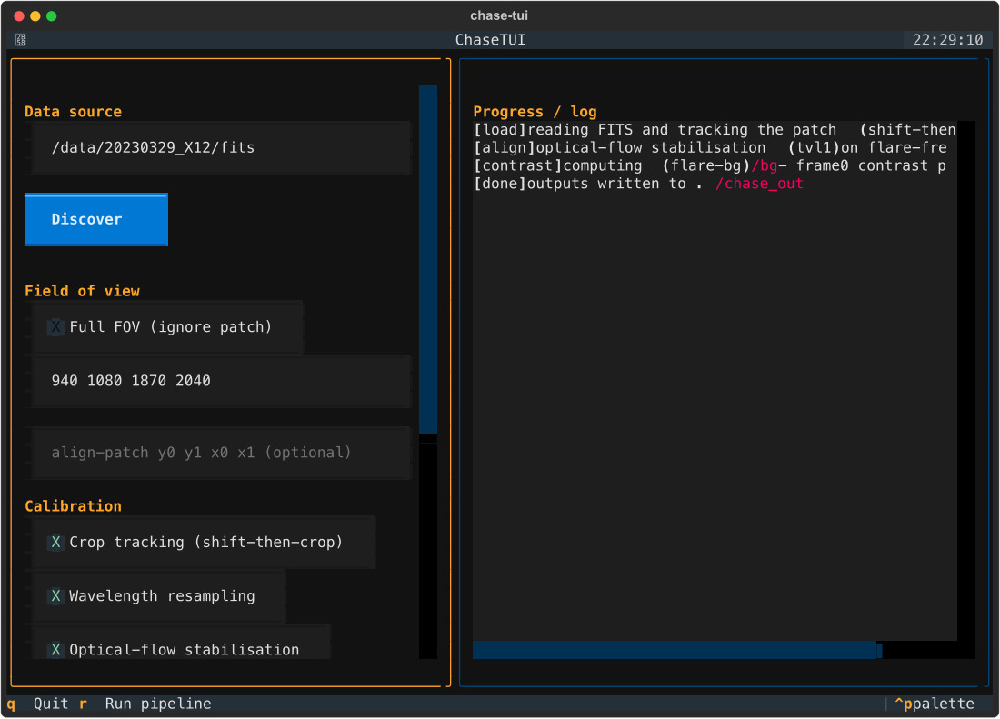

# The TUI (`chase-tui`)

A menu-driven terminal interface for people who don't want to memorise flags.
It is a **thin front-end over the SDK** — every control maps to a
`chase.config.Config` field, and **Run** calls `chase.run_pipeline`. No analysis
logic lives in the TUI.

```bash
pip install -e '.[tui]'   # installs Textual
chase-tui                 # or: python -m chase.tui
```



## Flow

1. **Data source.** Type a folder of `*HA.fits` (+`*FE.fits`), a single FITS, a
   `.txt` URL list, or a URL, then press **Discover** to see how many HA/FE cubes
   were found.
2. **Field of view.** Tick *Full FOV*, or enter a patch `y0 y1 x0 x1`. Optionally
   enter a separate, smaller **alignment patch** (used only for shift estimation —
   Alex's trick for reducing wobble: small box for the shift, big box for the data).
3. **Calibration.** Toggle crop tracking, wavelength resampling, optical-flow
   stabilisation, contrast profile, and frozen colour limits.
4. **Temperature.** Choose `none / halpha / fe_planck / fe_eb / fe_voigt / double`.
5. **Run.** Press **Run pipeline** (or the `r` key). Progress streams into the log
   pane on the right, stage by stage.
6. **Results.** The log lists every output file and where it was written.

## Keys

| Key | Action |
|-----|--------|
| `r` | Run the pipeline |
| `q` | Quit |
| Tab / Shift-Tab | Move between fields |

## Graceful degradation

- **No Textual installed** → `chase-tui` prints install instructions and the
  equivalent CLI/config commands, then exits 0/1 cleanly (it never crashes).
- **Non-interactive / dumb terminal** (no TTY) → it detects this and tells you to
  use the `chase` CLI instead.

The screenshot above is a real Textual SVG export captured headlessly in CI-style
conditions; regenerate it any time with `app.export_screenshot()` inside
`App.run_test()`.
